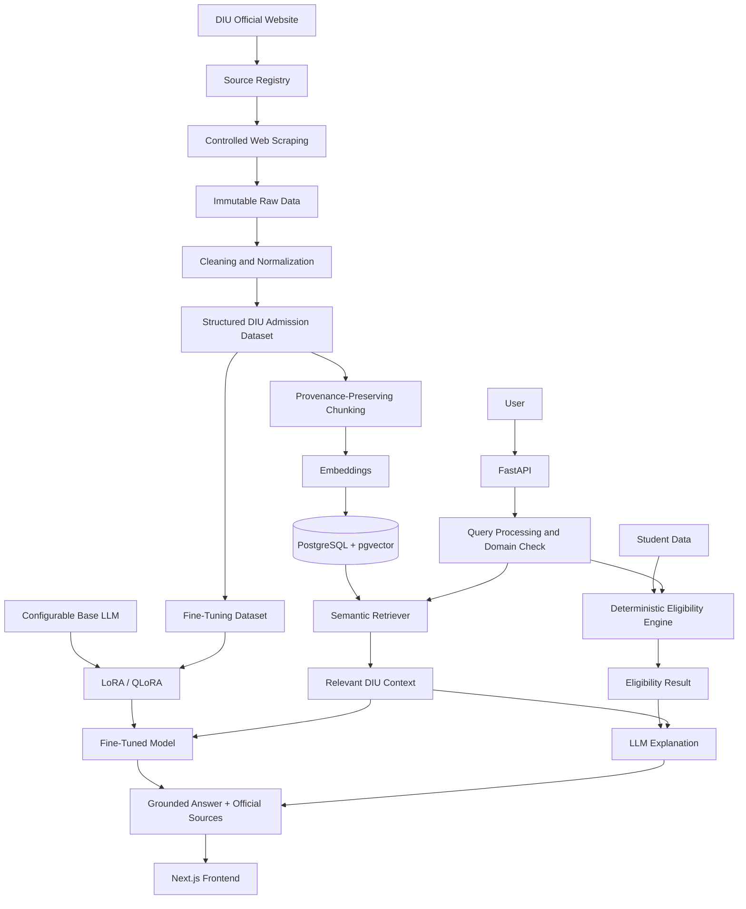

# AI Architecture

## Boundaries

- The registry controls collection; the scraper must not crawl the entire domain.
- Raw data is immutable; cleaning, chunking, and dataset generation create versioned derivatives.
- Model and embedding choices remain configurable.
- Eligibility decisions come only from verified deterministic rules; the LLM cannot override them.
- Identity, terminology, clarification, refusal, uncertainty, and response structure are stable fine-tuning behavior.
- Fees, deadlines, notices, requirements, scholarships, and waivers are changing facts supplied primarily through RAG.
- FastAPI owns orchestration and the contract; the frontend contains no admission decision logic.

